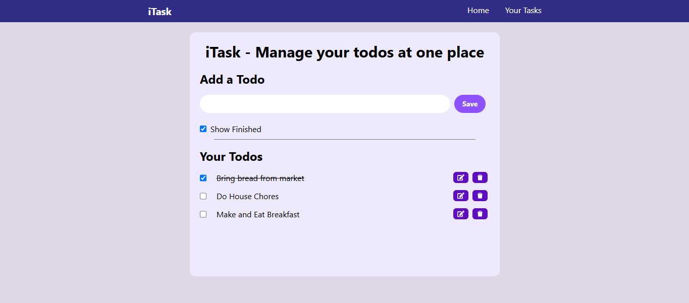

# 📝 React Todo App

A simple and responsive Todo List application built with **React**, **Tailwind CSS**, and **React Icons**. The app allows users to manage their daily tasks with an intuitive and clean user interface. Todos are stored in the browser using localStorage, so they remain available even after refreshing or reopening the application.

## ✨ Features

* ➕ Add new todos
* ✏️ Edit existing todos
* ✅ Mark todos as completed
* 🗑️ Delete todos
* 📱 Responsive design
* 🎨 Clean UI built with Tailwind CSS
* ⭐ Icons powered by React Icons
* 💾 Persistent storage using localStorage
* 🔄 Automatically restores saved todos on page reload

## 🛠️ Tech Stack

* React
* Tailwind CSS
* React Icons
* Vite
* localStorage (Browser Web Storage API)

## 📸 Preview

> 

## 🚀 Getting Started

### Prerequisites

* Node.js (v18 or later recommended)
* npm

### Installation

1. Clone the repository

```bash
git clone https://github.com/SahilAdvani/react-todo-app.git
```

2. Navigate to the project directory

```bash
cd react-todo-app
```

3. Install dependencies

```bash
npm install
```

4. Start the development server

```bash
npm run dev
```

The application will be available at:

```text
http://localhost:5173
```

## 📦 Build for Production

```bash
npm run build
```

To preview the production build:

```bash
npm run preview
```

## 📁 Project Structure

```text
react-todo-app/
├── public/
├── src/
│   ├── assets/
│   ├── components/
│   ├── App.jsx
│   ├── main.jsx
│   └── index.css
├── package.json
└── vite.config.js
```

## 📚 Dependencies

* React
* Tailwind CSS
* React Icons
* Vite

## 🌐 Live Demo

Deployed on Vercel:

> [https://react-todo-app-omega-ashy.vercel.app/](https://react-todo-app-omega-ashy.vercel.app/)

## 🤝 Contributing

Contributions are welcome! Feel free to fork the repository, make improvements, and submit a pull request.

## 📄 License

This project is licensed under the MIT License.
